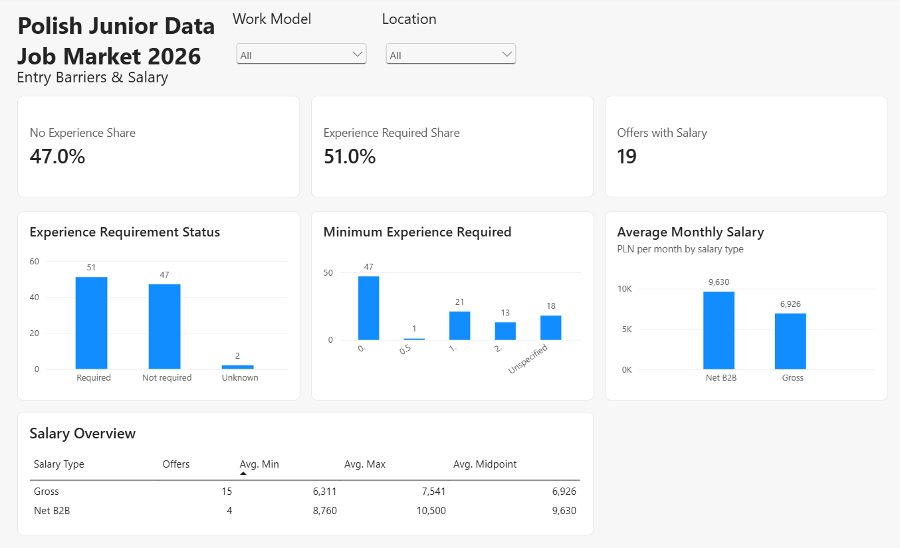
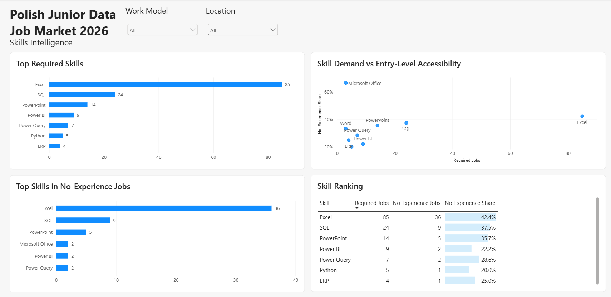
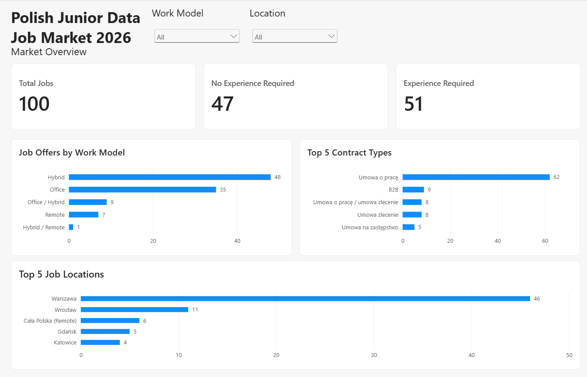

# Polish Junior Data Job Market 2026

Portfolio project analyzing **100 confirmed junior / entry-level data-related job offers in Poland** to understand which skills are most requested, how strong the experience barrier is, and what entry-level candidates can realistically target.

The project combines **data cleaning, PostgreSQL analysis and Power BI** to turn real job postings into practical job-market insights.

## Project goals

The analysis focuses on five questions:

1. Which technical skills appear most often in junior data-related job offers?
2. Which skills are most accessible in jobs that do not require previous experience?
3. How often do employers require prior professional experience?
4. How do work model and location affect entry-level opportunities?
5. What salary ranges are visible in offers that publish compensation?

## Dataset

The final sample contains **100 confirmed junior / entry-level offers** from Polish job portals.

Included roles cover areas such as:

- Data Analysis
- Business Intelligence / Reporting
- Controlling / Financial Analysis
- Data Quality
- Master Data
- Supply Chain / Operations Analytics
- other data-adjacent analytical roles

Roles such as Data Engineering, Data Science / ML, pure software development, generic administration, customer service and non-analytical positions were excluded.

### Main fields

The cleaned dataset includes:

- job title
- company
- location
- work model
- contract type
- salary range and salary type
- minimum experience requirement
- experience status
- required skills
- source and job-offer URL

Skills were normalized into separate `skills` and `job_skills` tables for SQL analysis.

## Data model

Main tables:

- `jobs` — one row per job offer
- `skills` — normalized skill dictionary
- `job_skills` — many-to-many relationship between jobs and skills

This structure makes it possible to analyze skill frequency, skill combinations and accessibility without storing skills as one comma-separated field.

## SQL analysis

The SQL part contains **13 business-oriented analyses**, including:

- most frequently mentioned skills
- most frequently required skills
- alternative skill requirements
- most common required skill pairs
- experience barrier
- minimum experience distribution
- skills vs. experience requirement
- work model distribution
- salary overview
- salary ranking within salary type
- top skills by work model
- entry-level skill accessibility ranking

The queries demonstrate:

- `JOIN`
- `GROUP BY`
- `HAVING`
- `CASE`
- conditional aggregation
- subqueries
- self joins
- CTEs
- `RANK()` / `DENSE_RANK()`
- `PARTITION BY`

SQL file: [`analysis_portfolio.sql`](analysis_portfolio.sql)

## Power BI dashboard

The Power BI report contains three pages.

### 1. Market Overview

Shows:

- total number of offers
- offers requiring / not requiring experience
- work model distribution
- top contract types
- top job locations



### 2. Skills Intelligence

Shows:

- top required skills
- top skills in no-experience jobs
- skill demand vs. entry-level accessibility
- skill ranking table



### 3. Entry Barriers & Salary

Shows:

- no-experience share
- experience-required share
- minimum experience distribution
- salary overview
- average monthly salary by salary type



The `Work Model` and `Location` slicers are synchronized across all three pages.

## Key findings

Some of the clearest findings from the 100-offer sample:

- **47%** of offers explicitly did not require previous experience.
- **51%** required previous professional experience.
- **2%** had unclear experience requirements.
- **Excel** was by far the most common required skill, appearing in **85 offers**.
- **SQL** appeared in **24 offers**.
- **PowerPoint** appeared in **14 offers**.
- **Power BI** appeared in **9 offers**.
- **Power Query** appeared in **7 offers**.
- **Python** appeared in **5 offers**.
- Hybrid work was the most common model (**48 offers**), followed by office-based work (**35 offers**).
- Warsaw was the largest location cluster (**46 offers**).

### Entry-level accessibility

Among frequently requested skills:

- Excel: **42.4%** of offers requiring Excel did not require previous experience.
- SQL: **37.5%**
- PowerPoint: **35.7%**
- Power Query: **28.6%**
- Power BI: **22.2%**
- Python: **20.0%**

This suggests that Excel and SQL provide the strongest combination of market demand and entry-level accessibility in this sample.

## Salary analysis

Only **19 of 100 offers** published salary information, so salary results should be treated as supplementary rather than representative of the whole market.

Average salary midpoint:

- Gross: **6,926 PLN / month** across 15 offers
- Net B2B: **9,630 PLN / month** across 4 offers

Gross employment salaries and net B2B rates are intentionally kept separate because they are not directly comparable.

## Methodology notes

- The dataset is a **market snapshot**, not a complete census of all junior data jobs in Poland.
- Only offers judged to be genuinely junior / entry-level and meaningfully analytical were included.
- Required skills were separated from skills listed only as alternatives or nice-to-have items where possible.
- Hourly salary ranges were normalized to monthly values using **168 hours per month**.
- Salary types were retained as separate categories (`gross`, `net_b2b`).
- Experience was classified as `Required`, `Not required` or `Unknown`.

## Limitations

- Sample size: 100 offers
- Salary information available for only 19 offers
- Job descriptions can be ambiguous about whether a skill or experience requirement is mandatory
- Results reflect the selected portals and the collection period
- The project focuses on junior / entry-level analytical roles, not the entire Polish data market

## Tools

- PostgreSQL
- pgAdmin 4
- Power BI
- Excel / CSV

## Repository structure

```text
polish-junior-data-job-market-2026/
│
├── README.md
├── analysis_portfolio.sql
├── junior_job_market.pbix
├── market_overview.png
├── skills_intelligence.png
├── entry_barriers_salary.png
└── data/
    ├── jobs.csv
    ├── skills.csv
    └── job_skills.csv
```

## Author

Rafał Dołęga  
Aspiring Data Analyst
